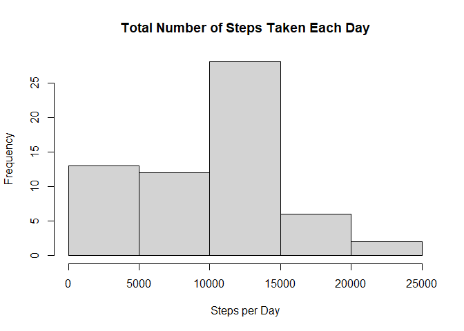
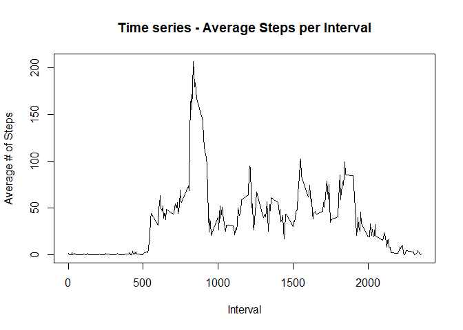
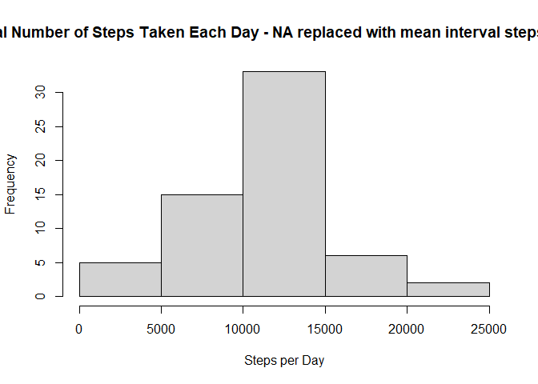
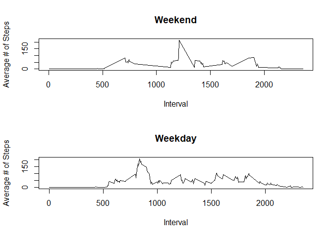

## Loading and preprocessing the data  
## Load zip into 'data' frame, convert date to date from character

```r
library(dplyr)
```

```
## 
## Attaching package: 'dplyr'
```

```
## The following objects are masked from 'package:stats':
## 
##     filter, lag
```

```
## The following objects are masked from 'package:base':
## 
##     intersect, setdiff, setequal, union
```

```r
data <- read.table(unz("activity.zip", "activity.csv"),header=TRUE, sep=",")
data$date <- as.Date(data$date, "%Y-%m-%d")
```

## What is mean total number of steps taken per day?

```r
dailysteps <- aggregate(x=data$steps,by=list(Day = data$date),FUN=sum,na.rm=TRUE,na.action=NULL)

hist(dailysteps$x, main="Total Number of Steps Taken Each Day",xlab="Steps per Day")
```

<!-- -->

## Mean Steps Taken per Day

```r
dailystepsmean <- mean(dailysteps$x)
dailystepsmean
```

```
## [1] 9354.23
```
## Median Steps Taken per Day

```r
dailystepsmedian <- median(dailysteps$x)
dailystepsmedian
```

```
## [1] 10395
```
## What is the average daily activity pattern?

```r
intervalsteps <- aggregate(x=data$steps,by=list(Interval = data$interval),FUN=mean,na.rm=TRUE,na.action=NULL)


plot(intervalsteps,type="l",ylab="Average # of Steps",main="Time series - Average Steps per Interval")
```

<!-- -->

## Time interval with Maximum number of steps (average)

```r
maxinterval <- intervalsteps[which.max(intervalsteps$x),]
maxint <- maxinterval[1]
maxint
```

```
##     Interval
## 104      835
```
## Imputing missing values - Calculate total missing values

```r
# Calculate number of NAs
missvalue <- sum(is.na(data))
missvalue
```

```
## [1] 2304
```

## Fill missing values - Use average steps for each interval by day of week

```r
# Add 'day of week' column to data
data <- mutate(data,day.of.week = weekdays(data$date))

# Create intervalday lookup column
data$intervalday = paste(data$interval,data$day.of.week)

# Create mean steps for each interval of each day of week to fill NA value
weekdayintervalsteps <- aggregate(x=data$steps,by=list(Interval = data$interval, Dayweek = data$day.of.week),FUN=mean,na.rm=TRUE,na.action=NULL)

# Create interval day lookup column
weekdayintervalsteps$intervalday = paste(weekdayintervalsteps$Interval,weekdayintervalsteps$Dayweek)
names(weekdayintervalsteps)[names(weekdayintervalsteps)=="x"] <- "avgintdaysteps"

fulldata <- data
nomissdata <- merge(fulldata[,c("steps","date","interval","intervalday")],weekdayintervalsteps,by="intervalday")

# replace NA values in steps with avg steps for each interval in each day
nomissdata$steps[is.na(nomissdata$steps)] <- (nomissdata$avgintdaysteps[is.na(nomissdata$steps)])

# recreate original dataset without missing values - nomissdata
nomissdata[c(1,5,6,7)] <- list(NULL)

# create total steps per day including avg interval/day values
nomissdailysteps <- aggregate(x=nomissdata$steps,by=list(Day = nomissdata$date),FUN=sum,na.rm=TRUE,na.action=NULL)
```

## Create Histogram showing total steps taken per day

```r
hist(nomissdailysteps$x, main="Total Number of Steps Taken Each Day - NA replaced with mean interval steps by day",xlab="Steps per Day")
```

<!-- -->

## Report mean steps, NAs replaced with averages

```r
dailystepsmean2 <- mean(nomissdailysteps$x)
dailystepsmean2
```

```
## [1] 10821.21
```

## Report median steps, NAs replaced with averages

```r
dailystepsmedian2 <- median(nomissdailysteps$x)
dailystepsmedian2
```

```
## [1] 11015
```
### Replacing NAs with average values changes mean and median steps,  causing mean steps to increase from 9354.23 to 10821.1, while median steps increase from 10,395 to 11,015. 


## Are there differences in activity patterns between weekdays and weekends?

```r
nomissdata <- mutate(nomissdata,day.of.week = weekdays(data$date))
nomissdata$daytype <- "weekday"
nomissdata$daytype[nomissdata$day.of.week == "Saturday"] <- "weekend"
nomissdata$daytype[nomissdata$day.of.week == "Sunday"] <- "weekend"

wkdaynomiss <- subset(nomissdata,daytype == "weekday")
wkendnomiss <- subset(nomissdata,daytype == "weekend")

wkdayintervalsteps <- aggregate(x=wkdaynomiss$steps,by=list(Interval = wkdaynomiss$interval),FUN=mean,na.rm=TRUE,na.action=NULL)
wkendintervalsteps <- aggregate(x=wkendnomiss$steps,by=list(Interval = wkendnomiss$interval),FUN=mean,na.rm=TRUE,na.action=NULL)

par(mfcol = c(2,1))
plot(wkendintervalsteps,type="l",ylab="Average # of Steps",main="Weekend")
plot(wkdayintervalsteps,type="l",ylab="Average # of Steps",main="Weekday")
```

<!-- -->

### Weekend days see a spike in steps in the mid-day time period (~interval 1200), where the spike in steps for Weekdays occurs earlier (~interval 800)
